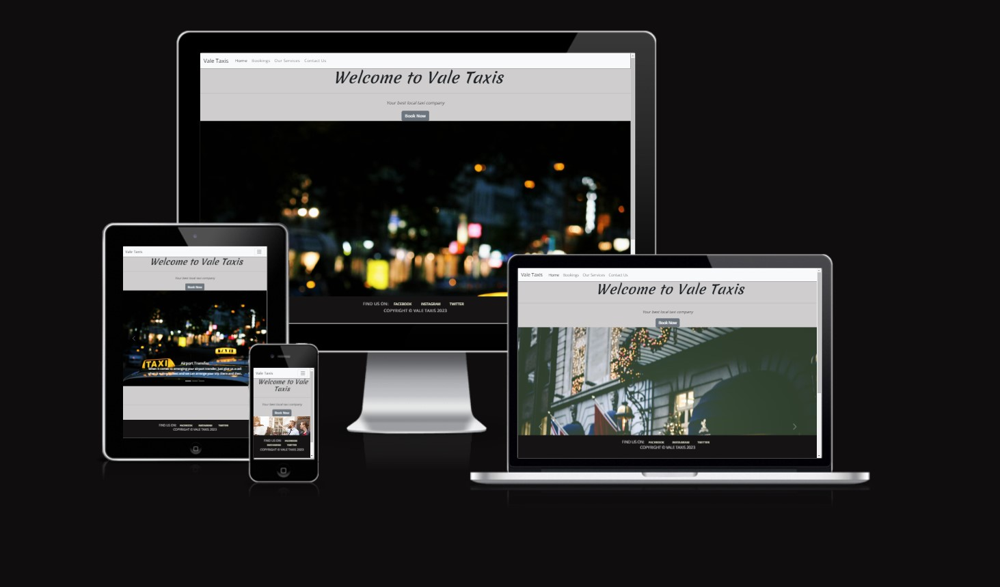
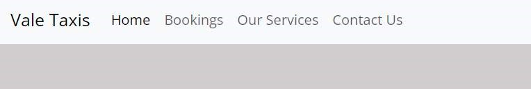
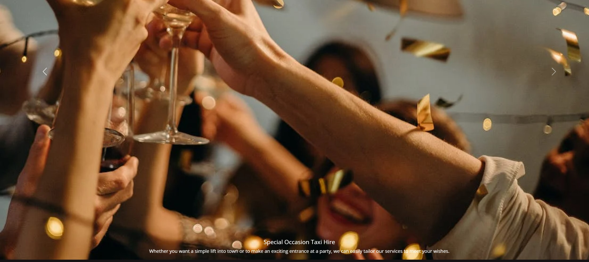
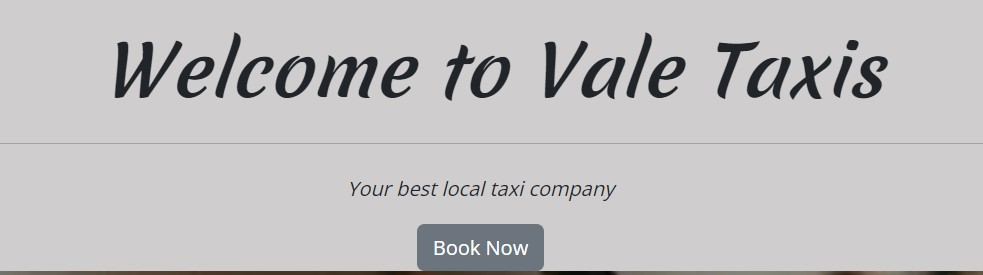
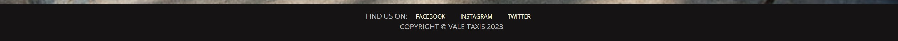
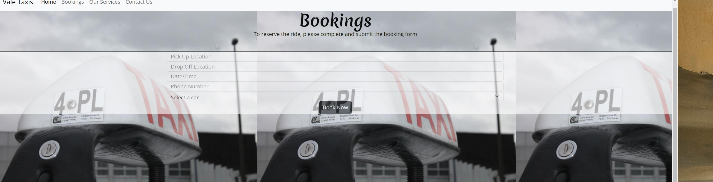
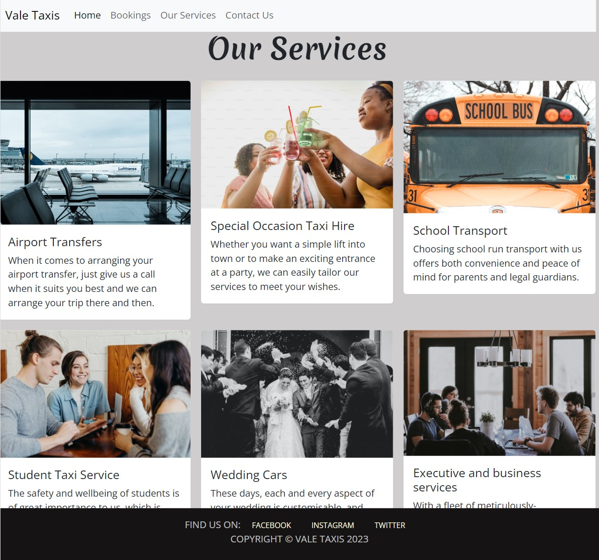
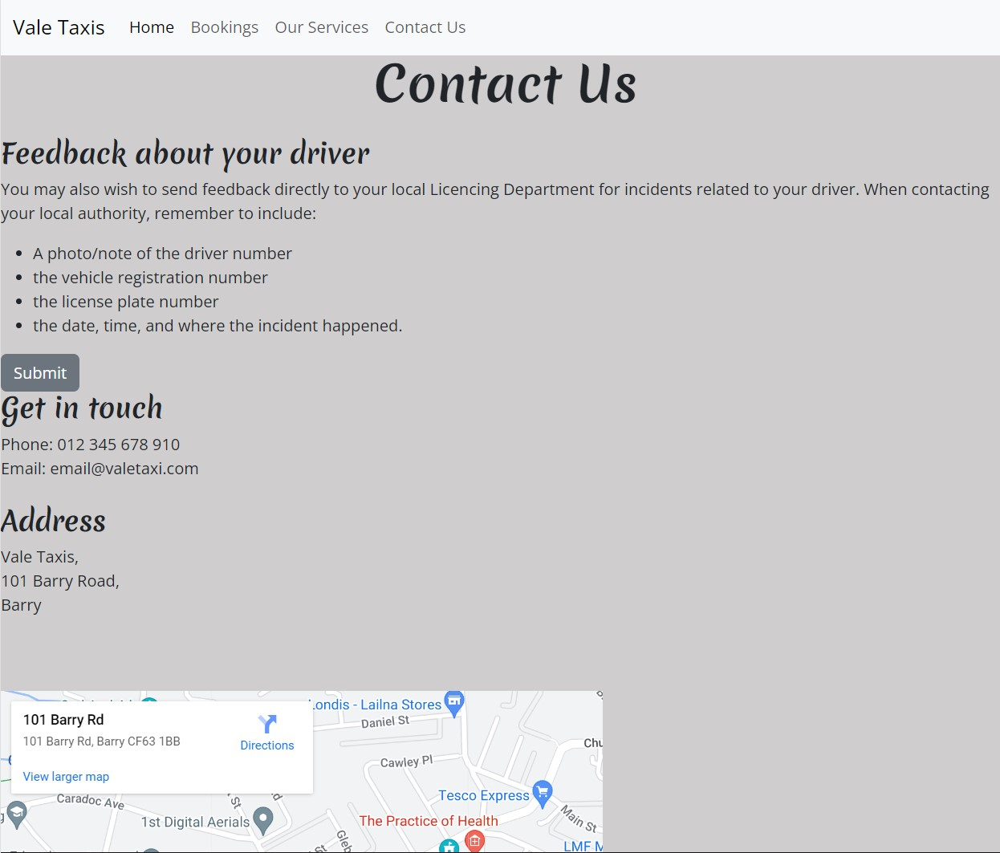
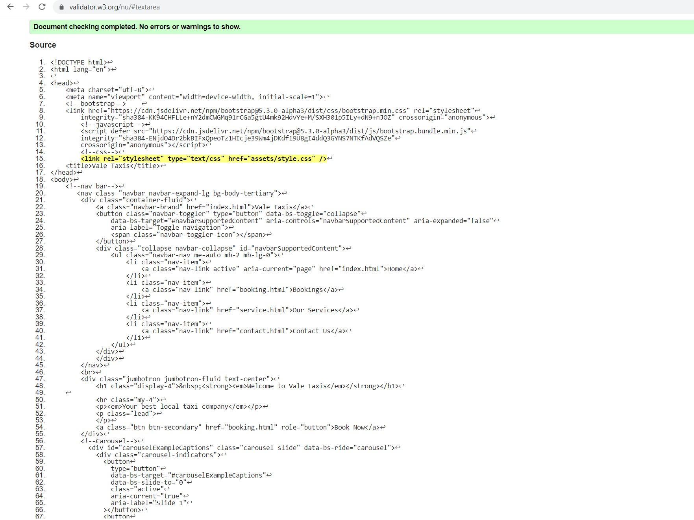
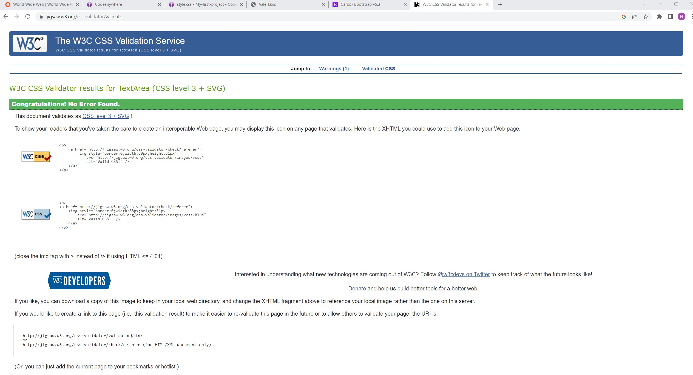

# My-first-project
milestone 1
# Vale Taxis

Vale Taxis is a site that helps people getting a taxi in the Vale of Glamorgan area. The site will be targeted toward custumors who are looking for a Taxi. Vale Taxis will be useful for peolpe booking a taxi.

## Features 

This website is targeting people who want to book a taxi. Therefor the site contains a main, booking, contact and service page. I used what I learnt from the course and Bootstrap 5 

### Existing Features

- __Navigation Bar__

  - Featured on all four pages, the full responsive navigation bar includes links to the Home page, service, booking and contact page and is identical on each page to allow for easy navigation.
  - This section will allow the user to easily navigate from page to page across all devices without having to revert back to the previous page via the ‘back’ button. 

- __The landing page image__

  - The landing includes a carousel with 3 pictures with text overlay to allow the user to see different services the site provide 
  - This section introduces the user to Vale Taxis with an eye catching animation to grab their attention

- __Welcome Section__

  - The welcome section will allow the user to see the booking button wich will take the user directly to the booking page. 
  

- __The Footer__ 

  - The footer section includes links to the relevant social media sites for Vale Taxis. The links will open to a new tab to allow easy navigation for the user. 
  - The footer is valuable to the user as it encourages them to keep connected via social media

- __The booking Page__

  - This page will allow the user to get book their ride. The user will be able to pick up a date, time and a pickup location, dropoff location withan option te select car type . 

  - I used bootstrap form and i made it transparent so the background image is still showing.

- __The service Page__

  - This page will allow the user to discover all the services that Vale taxis provides.

  - I used Bootstrap Components Cards (6 cards ) every card contain an image and small paragraph describing the service.

- __The contact Page__

  - This page will allow the user to send a feedback or a complaint. Also will show the number, email and address for vale Taxis including a map.

  

## Validator Testing 

- Testing frequantly using W3c validator.

- HTML
  - No errors were returned when passing through the official [W3C validator](https://validator.w3.org/nu/#textarea)
- CSS
  - No errors were found when passing through the official [(Jigsaw) validator](https://jigsaw.w3.org/css-validator/validator)

- Javascript
  - https://jshint.com/
## Deployment

- The site was deployed to GitHub pages. The steps to deploy are as follows: 
  - In the GitHub repository, navigate to the Settings tab 
  - From the source section drop-down menu, select the Master Branch
  - Once the master branch has been selected, the page will be automatically refreshed with a detailed ribbon display to indicate the successful deployment. 

## Credits 

- I got extra help from my Mentor
- (https://learn.codeinstitute.net/)
- (Google.com)
- (https://www.w3schools.com/)

### Content 

- Instructions on how to implement form validation on the Sign Up page was taken from [Specific YouTube Tutorial](https://www.youtube.com/)
- The icons in the footer were taken from [Font Awesome](https://fontawesome.com/)

### Media

- The photos used on the home and booking page are from This Open Source site :
https://unsplash.com/

