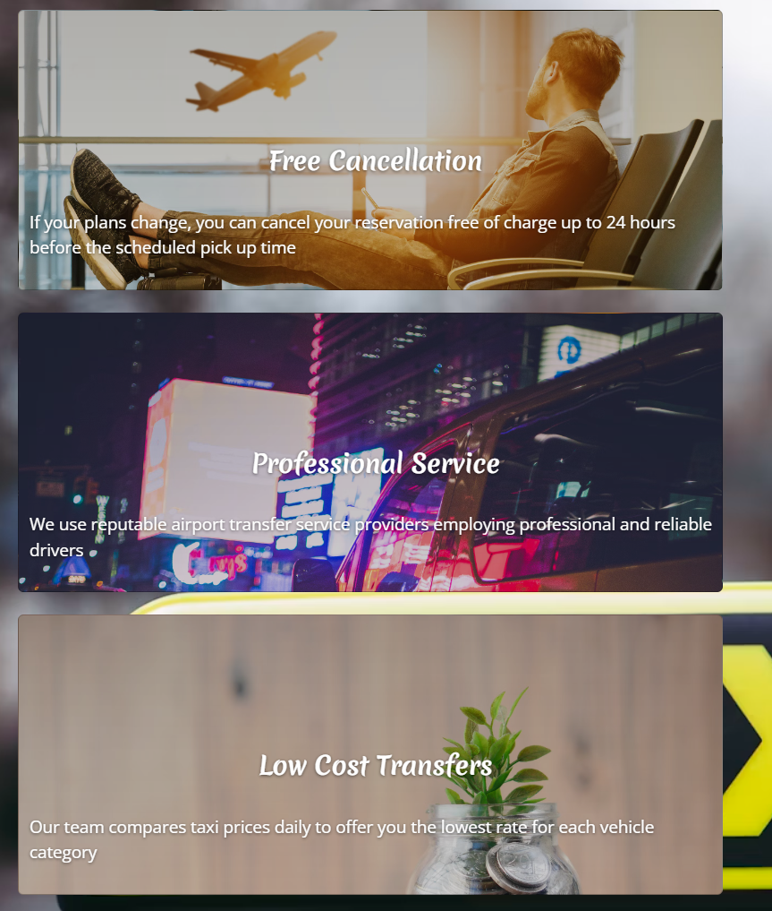

  

[Vale Taxis](https://aounhe.github.io/My-first-project2/) is a site that helps people getting a taxi in the Vale of Glamorgan area. The site will be targeted toward custumors who are looking for a Taxi. Vale Taxis will be useful for peolpe booking a local taxi or airport transfer.

## Table of Contents
1. 

    
<a href="#ux">UX</a>

    <ul>
    <li>

    
<a href="#goals">Goals</a>

    - [Visitor Goals](#visitor-goals)
    - [Business Goals](#business-goals)
    - [User Stories](#user-stories)
    
</li>

    - [Fonts](#fonts)
    - [Icons](#icons)
    - [Colors](#colors)
    - [Images](#images)
    - [Styling](#styling)
    
</li>
    </ul>

2. 

    
<a href="#features">Features</a>

    <ul>
    <li>

    
<a href="#page-elements">Page Elements</a>

    - [All Pages](#all-pages)
    - [Index Page](#index-page)
    - [Contact Page](#contact-page)
    
</li>

3. 

    
<a href="#technologies-used">Technologies Used</a>

    - [Languages](#languages)
    - [Frameworks](#frameworks)
    - [Libraries](#libraries)
    - [Platforms](#platforms)
    - [Other Tools](#other-tools)

4. 

    
<a href="#testing">Testing</a>

    <ul>
    <li>

    
<a href="#methods">Methods</a>

    - [Validation](#validation)
    - [General Testing](#general-testing)
    - [Mobile Testing](#mobile-testing)
    - [Desktop Testing](#desktop-testing)
    
</li>

   

5. 

    
<a href="#deployment">Deployment</a>

    - [Github deployment](#github-deployment)
    - [How To Fork](#how-to-fork)
    
    
</li>
    </ul>

6. 

    
<a href="#credit-and-contact">Credit and Contact</a>

    - [Credits](#credits)
    - [Contact](#contact)

----

# UX
## Goals
### Visitor Goals
The target audience for Vale taxis are:
- People who want to book a local taxi.
- People who want to book an Airport run.
- Parents who are intrested in School run.
- People interested in hiring a luxury car for wedding event.

User goals are:
- find a quick way to book a taxi online.
- Prebook a taxi depends on the need of size vhecile.
- Get an overview of price charges.

Vale taxis fills these needs by:
- providing a responsive website with booking form.
- Highlighting the Contact page in the header.
- Providing social media links to follow the latest deals.

### Business Goals
The Business Goals of Vale taxis are:
- Get more buisness from local council.
- Attract more customers.
- Provide easy ways to book a taxi.
- Gain interest and connect with social media.

### User Stories
1. As a passenger, I want to link the credit card to my profile so that I can pay for a ride faster, easier and without cash.
0. As a passenger, I want several available drivers to be displayed so that I can choose the most suitable option for me.
0. As a passenger, I want to see the estimated fare and duration of the ride before I confirm the booking.
0. As a passenger, I want to cancel the ride without penalty if the driver is late by more than 10 minutes.
0. As a passenger, I want to receive a receipt by email after the ride is completed.

### Fonts

- The primary font, [Merienda One](https://fonts.google.com/specimen/Merienda) was chosen because it is standard, plain and informative but not too rigid. It looks friendly and conversational but holds a seriousness. It is also sans-serif, making it very easily readable throughout different color schemes and complementary to the font used for Headings.

### Icons

- Icons are taken from the [Fontawesome](https://fontawesome.com/) Icon library and are utilised as classes in the `<i>` tag.
- As they are utilised as classes, they can easily be styled using other classes or IDs in the same tag. I often used Bootstrap classes to style them uniformly.
- Icons are utilised in the footer for social account icons and the "scroll-to-top" arrow on the gallery page.
- Icons are utilisedin the service section also.
### Colors

- I wanted the site to maintain a minimal aesthetic, colors are very basic and clean for highlighting the photos.
- Text is primarily written in white to contrast on the bold color backgrounds of the primary and accent colors.

### Images

- I used one image for the background from [Unsplash](https://unsplash.com)

### Styling
- For this project I have utilised Bootstrap 5 source files to override their class defaults to my liking, making customisation much easier. The entire site can be restyled with a single switch in the code.

----

# Features
## Page Elements
### All Pages
#### Navbar

- The Navbar is simple, providing only three options with only two very evident the Home and Contact pages, to maintain the minimalist style.

- On smaller devices, the menu becomes collapsible.
- The mobile nav button has been placed to the right for ease of use with one hand.
- The navbar is fixed so it is visible no matter how far you scroll.

#### Footer

- Located at the bottom of every page, mainly highlighting contact and social.

### Index Page

- Used as a splash image to the background with a yellow taxi sign.
- An introduction to the website explaining to custumors what service we can provide.

- A container for highlighted services.

- A custumor rating service based on reviews.

- Adverts cards next to the booking form.

-A responsive booking form alows users to choose vehicle size and pick up an exact date time.

#### About Section

- The section is responsive and the two columns will stack on resize.
- The section contains a fully responsive image and a small text section with responsively sized text.

### Contact Page

- The form has validation and is fully responsive.
- A google map adress location.

# Technologies Used
## Languages
- [HTML](w3.org/standards/webdesign/htmlcss)
    * Page markup.
- [CSS](w3.org/standards/webdesign/htmlcss)
    * Styling.

## Frameworks
- [Bootstrap5](https://getbootstrap.com/)
    * Used for basic styles and outline.

## Libraries
- [Google Fonts](https://fonts.google.com)
    * Font Styles.
- [Fontawesome](https://fontawesome.com/)
    * Used for icons

## Platforms
- [Github](https://github.com/)
    * Storing code remotely and deployment.
- [Codeanywhere](https://codeanywhere.com)
    * IDE for project development.

## Other Tools

- [Coolors](https://coolors.co/)
    * Creating color pallettes.

----

# Testing
## Methods
### Validation
- HTML has been validated with [W3C HTML5 Validator](https://validator.w3.org/).
- CSS has been validated with [W3C CSS Validator](https://jigsaw.w3.org/css-validator/) and auto-prefixed with [CSS Autoprefixer](https://autoprefixer.github.io/).
- Links checked with [W3C Link Checker](https://validator.w3.org/checklink).

### General Testing
- Each feature was developed and tested in its own branch before being merged with master. Branches were subsequently deleted.
- Each time a feature was added, all the functions were tested to see if there was an impact.
- The site was sent to friends for feedback and testing.
- All forms have validation and will not submit without the proper information.
- External links open in a new tab.

### Mobile Testing
- I tested the site personally on my Android device, going through the entire process, checking buttons, functions, checking out, etc. I was personally unable to test on iOS.
- The site was sent to friends and relatives for them to follow the same process. They have tested on their devices, including iOS.
- Chrome was utilised to inspect the site in mobile format, going through the pages and functions.

### Desktop Testing
- The site was developed on a Chromebook and, as such, the majority of testing occurred on Chrome.
- The site was tested by friends and relatives on numerous desktop devices.
- The site was marginally tested on other browsers, such as Firefox and Edge.
- Internet Explorer was not tested and the site was not developed with it in mind as support for the browser is gradually being dropped.

----

# Deployment
### Github Deployment

Github Pages was used to deploy the live website. The instructions are as followed:

1. Log in (sign up) to Github.
2. Search for this repository, Weather Check.
3. Navigate to the settings tab.
4. On the left hand menu click on the pages link.
5. In the source section, select main from the drop down menu under Branch.
6. Select root from the drop down folder and click save.
7. Your live Github pages site is now deployed at the following: [aounhe]()

### How to Fork

To fork the paddle-adventures repository:

1. Go to the GitHub repository.
2. Click on Fork button in the upper right-hand corner.

## Credits and Contact
### Credits

- [bing](bing.com)

### Contact
Please feel free to contact me at `aounhe@hotmail.com`